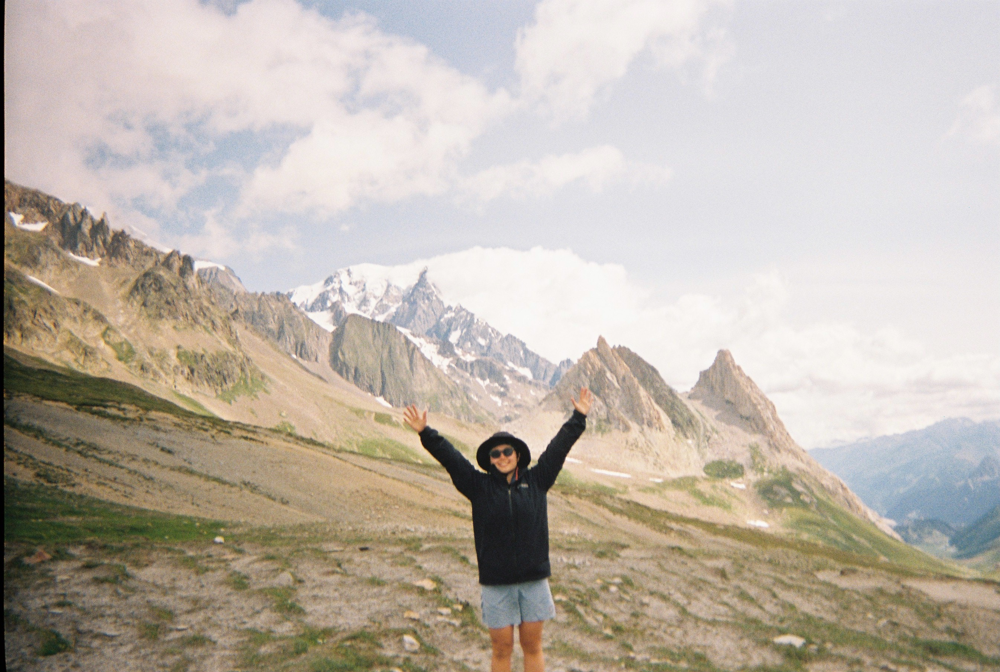

  

  
  

  

---

### 🧑‍🎓 About Me

MS student at **Ewha Womans University**, researching at [Human-Centered AI Lab](https://hai.ewha.ac.kr/) (HAI Lab @ Ewha).

Currently studying **AI Alignment** through the [ARENA Curriculum](https://www.arena.education/), with research interests in **Mechanistic Interpretability**, **Bias & Fairness in ML**, and AI safety.

Learning notes are documented at my [blog](https://bang-mj.github.io).

🏔️ **Off-screen**: I love mountains. Completed **Tour du Mont Blanc (TMB)** as a backpacking trip in summer 2023. Next goal: backpacking in Patagonia.

---

### 🎯 Current Focus

- 🏛️ Research at **[HAI Lab @ Ewha](https://hai.ewha.ac.kr/)**
  - 🔬 **Media Bias** in LLMs through Mechanistic Interpretability
  - 🌏 **Cultural Bias** in AI systems
- 📚 Self-studying **AI Alignment** via [ARENA Curriculum](https://www.arena.education/) 
- ✍️ Writing at [bang-mj.github.io](https://bang-mj.github.io)

---

### 🛠️ Tech Stack

| **Category** | **Technologies** |
| :--- | :--- |
| **Languages** |     |
| **ML / DL** |     |
| **Data** |     |
| **Tools** |      |

---

### 🏆 Achievements

- 🥇 **2025 국립중앙도서관 도서관 데이터 활용 공모전 — 최우수상**
- 🎓 **2024 제3회 OUTTA AI Bootcamp** 수료

---

### 📊 GitHub Activity

  

  
  

---

### 📂 Featured Projects

#### 🎓 Graduation Project

* 📖 **[Beyond-Imagination](https://github.com/Beyond-Imagination38/Modam)** — RAG-based Book Club Platform

#### 📖 Study Logs

* 🧠 **[ARENA Curriculum](https://github.com/BANG-mj/ARENA_3.0)** — AI alignment self-study (in progress)
* ✍️ **[Personal Blog](https://github.com/BANG-mj/BANG-mj.github.io)** — Quarto-based learning blog
* 🤖 **Euron(Data Analytics & AI Club @ Ewha)** — [Machine Learning Track](https://github.com/BANG-mj/7th-ML) · [Deep Learning Track](https://github.com/BANG-mj/8th-DL)

---

### 📬 Connect With Me

  
  
  

> [!NOTE]
> Currently building foundations in AI alignment. Open to discussions about mechanistic interpretability, AI bias, and safety research.

